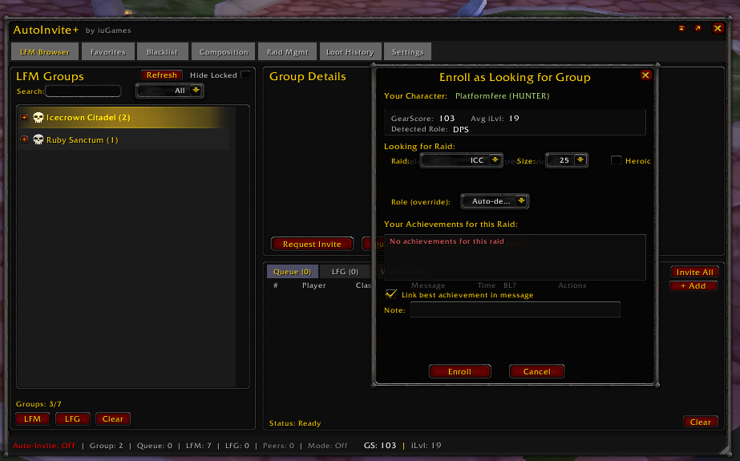
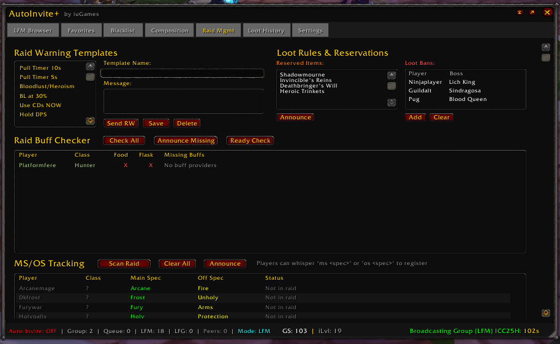
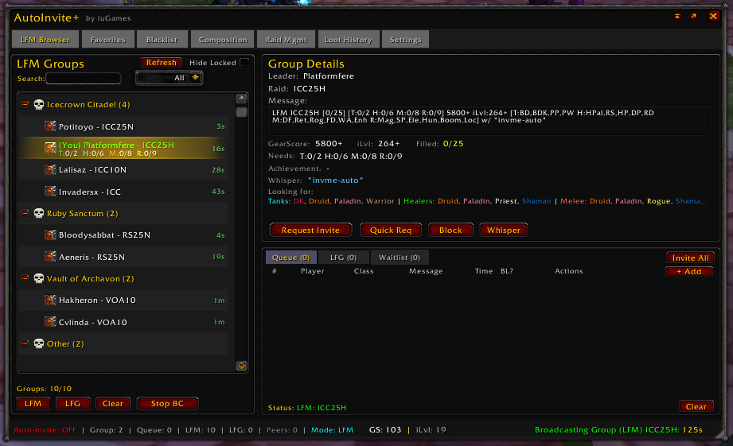

# AutoInvite Plus v5.5.0

A comprehensive raid organization suite for World of Warcraft 3.3.5a (WotLK) with LFM/LFG browser, auto-invite system, raid management tools, and loot tracking.

---

## Screenshots

### LFM Browser
Browse and filter groups advertised in chat channels, organized by raid type with smart message parsing.

### LFG Browser
Find players looking for groups with class/spec detection and smart filtering.

### Scanned Message Interpretation
Smart parsing extracts raid type, requirements, GearScore, and "Looking For" specs from chat messages.

### Raid Management
Raid warnings, buff checker, MS/OS tracking, loot rules, and loot ban management.

### Loot History
Track loot drops per boss with winner assignment and export functionality.

### Raid Promotion
Quick promotion tools for raid assist and master looter assignment.

---

## Features

### LFM Browser
- **Group Tree View**: Browse groups advertised in chat organized by raid type (ICC, RS, TOC, etc.)
- **Real-time Scanning**: Automatically captures LFM messages from Trade, LFG, and custom channels
- **Smart Parsing**: Extracts raid type, requirements, GearScore, and "Looking For" class/specs
- **Class-Colored Display**: Looking For specs shown with class colors and tooltip details
- **Group Details Panel**: View leader, requirements, composition needs, and detected achievements
- **Quick Request**: Send auto-invite keywords to groups with one click
- **Detailed Request**: Send comprehensive whisper with your class, spec, GS, iLvl, and achievements
- **Instance Lockout Detection**: Groups for locked instances highlighted in red with filter option

### LFG Browser
- **Player Listings**: Browse players looking for groups with class, spec, and GearScore
- **Smart Filtering**: Filter by raid, class, role, or GearScore range
- **Quick Actions**: Add players directly to queue or waitlist with Q+/WL+ buttons
- **Real-time Updates**: Automatic refresh as new LFG messages are detected

### Auto-Invite System
- **Keyword Detection**: Automatically invite players who whisper trigger keywords
- **Smart Conditions**: Role matching based on "Looking For" class/spec preferences
- **Queue System**: Optional queue mode for manual approval of invite requests
- **Blacklist Integration**: Flag or auto-reject blacklisted players
- **Response Messages**: Customizable automatic whisper responses
- **Guild Only Mode**: Restrict invites to guild members only

### Raid Management (v5.3+)
- **Raid Warning Templates**: Pre-configured and custom raid warning messages
- **Buff Checker**: Scan raid for missing buffs with intelligent caster assignment
- **MS/OS Tracking**: Track main spec and off spec declarations via whispers
- **Loot Rules**: Configure and announce reserved items
- **Loot Bans**: Ban players from specific boss loot with roll warnings

### Loot History (v5.3+)
- **Session Tracking**: Automatic raid session creation and tracking
- **Boss Detection**: Auto-detect boss kills from combat log
- **Loot Recording**: Track all loot drops with item links
- **Winner Assignment**: Assign loot winners with dropdown selection
- **Export to Chat**: Post boss loot to Say/Party/Raid chat

### Composition Advisor
- **Raid Templates**: Pre-configured templates for WotLK, TBC, Classic raids
- **Role Tracking**: Track tanks, healers, and DPS requirements
- **Class Breakdown**: Visual display of current raid composition
- **Buff/Debuff Tracking**: Comprehensive tracking of 100+ raid buffs and debuffs
- **Spec-Aware Detection**: Buffs checked against actual player specs
- **Raid Member Table**: Scrollable table with class, role, spec, and GearScore

### Blacklist & Favorites
- **Search & Filter**: Find players by name or source
- **Multiple Sources**: Track where each entry came from
- **Export/Import**: Share lists with guildmates (Simple, Full, CSV formats)
- **Quick Actions**: Add/remove from LFM/LFG browser rows

### DataBus (Addon Communication)
- **Peer Discovery**: Detect other AutoInvite Plus users online
- **LFM/LFG Sharing**: Share listings with addon users via addon channels
- **Real-time Sync**: Instant updates when peers broadcast listings

---

## Installation

1. Download and extract to `Interface/AddOns/AutoInvitePlus`
2. Ensure all files are in the folder (not in a subfolder)
3. Restart WoW or type `/reload`

---

## Slash Commands

| Command | Description |
|---------|-------------|
| `/aip` | Open main window |
| `/aip toggle` | Toggle auto-invite on/off |
| `/aip queue` | Show invite queue |
| `/aip bl <name>` | Add player to blacklist |
| `/aip unbl <name>` | Remove from blacklist |
| `/aip clear` | Clear invite queue |
| `/aip spam` | Broadcast invite message once |
| `/aip status` | Show current addon state |
| `/aip help` | List all commands |

---

## Quick Start Guide

### Setting Up Auto-Invite

1. Open settings with `/aip` and go to **Settings** tab
2. Check **Enable Auto-Invite**
3. Set trigger keywords (default: "inv;invite")
4. Choose listening channels (Whisper recommended)
5. Players who whisper your keywords will be invited automatically

### Creating a Group (LFM)

1. Open the addon with `/aip`
2. Click **Add Group** button
3. Select raid type, size, and requirements
4. Enter minimum GearScore and iLvl
5. Optionally specify "Looking For" class/specs
6. Click **Create** to start broadcasting

### Finding Groups

1. Open the addon with `/aip`
2. Browse the **LFM Browser** tab showing available groups
3. Click a group to see details in the right panel
4. Use **Quick Req** to send the invite keyword
5. Or use **Request Invite** for a detailed application

### Using Raid Management

1. Go to **Raid Mgmt** tab
2. Use **Raid Warning Templates** for quick raid announcements
3. Click **Check All** in Buff Checker to scan for missing buffs
4. Click **Announce** to request buffs from available casters
5. Use **Loot Bans** to restrict players from specific boss loot

### Tracking Loot History

1. Go to **Loot History** tab
2. Sessions are auto-created when you enter a raid
3. Boss kills are auto-detected from combat log
4. Click items to assign winners
5. Use Say/Party/Raid buttons to post loot to chat

---

## Settings Overview

### Auto-Invite System
- **Enable Auto-Invite**: Master toggle for automatic inviting
- **Trigger Keywords**: Words that trigger auto-invite (separated by ;)
- **Max Group Size**: Maximum players to invite
- **Auto-convert to Raid**: Automatically create raid when group is full
- **Guild Only**: Only accept requests from guild members
- **Use Queue**: Require manual approval for invites
- **Smart Conditions**: Enable role/class matching based on Looking For specs

### Listen Channels
Select which channels to monitor for invite requests:
- Whisper (recommended)
- Say, Yell, Guild
- Custom channels

### Broadcast Settings
- Select target channels
- Set message template
- Configure cooldown between broadcasts
- Auto-broadcast interval
- Chat throttle protection with auto-tuning

### LFM/LFG Scanner
- Enable chat scanning for other players' messages
- Select channels to scan
- Set cache duration (groups expire after 15 minutes)

### Response Messages
Customize automatic whisper responses:
- Invite accepted message
- Invite rejected message
- Waitlist message

### GUI Appearance
- **Window Opacity**: Adjust transparency (30-100%)
- **Unfocused Opacity**: Reduce opacity when not hovering

---

## Tips & Best Practices

### Avoid Chat Bans
- Use auto-tuned broadcast intervals
- Don't spam multiple channels simultaneously
- Default settings are optimized for safety
- Watch the chat ban indicator in the footer

### Efficient Group Building
- Set clear GearScore/iLvl requirements
- Use "Looking For" specs to attract the right players
- Use the queue system for quality control
- Blacklist problematic players promptly

### Loot Management
- Set up reserved items before raid starts
- Add loot bans for players with restrictions
- Roll warnings will alert you when banned players win rolls
- Export loot to chat for transparency

---

## Troubleshooting

### Groups not appearing in browser
- Ensure LFM/LFG scanner is enabled in settings
- Check that the correct channels are selected for scanning
- Groups expire after 15 minutes of inactivity

### Auto-invite not working
- Verify "Enable Auto-Invite" is checked
- Check that keywords match what players are whispering
- Ensure listening channels include Whisper

### Panel not loading
- Check for Lua errors with `/script` or BugGrabber addon
- Ensure all addon files are present
- Try `/reload` to refresh the UI

### Buff checker not finding buffs
- Make sure you're in a raid or party
- Click "Check All" to rescan
- Only buffs with available casters in the group are checked

---

## Changelog

### v5.5.0
- **Loot Ban System**: Ban players from specific boss loot with dropdown selection
- **Roll Warnings**: Automatic warnings when loot-banned players win rolls
- **Looking For Parsing**: Smart detection of class/spec codes in LFM messages
- **Class-Colored Display**: Looking For specs shown with WoW class colors
- **Smart Auto-Invite**: Role matching considers Looking For class/spec preferences
- **Buff Checker Enhancement**: Only checks buffs with available casters
- **Intelligent Buff Assignment**: Distributes buff requests among available casters
- **MS/OS Announce**: Quick button to announce spec changes to raid/party

### v5.3.0
- **Raid Management Panel**: New tab with raid warnings, buff checker, MS/OS tracking
- **Loot History Panel**: Track loot drops per boss with winner assignment
- **Loot Rules**: Configure and announce reserved items
- **DataBus**: Inter-addon communication for LFM/LFG sharing

### v5.0.0
- **Major Refactor**: Complete codebase reorganization
- **DRY Architecture**: Shared utilities and parsing modules
- **UIFactory**: Standardized UI component creation
- **TreeBrowser**: Hierarchical tree widget for group/player browsing
- **Enhanced Scanning**: Improved chat message parsing accuracy

### v4.3.x
- Spec-aware buff/debuff detection
- Composition UI improvements with spec indicators
- Instance lockout detection across all panels
- Broadcast system improvements with throttle protection
- Queue/Waitlist enhancements

---

## Credits

- **Author**: iuGames
- **Original Code**: Martag of Greymane, Matthias Fechner

---

## Support

Report issues at: https://github.com/iugames/autoinviteplus/issues

---

*AutoInvite Plus - Making raid organization effortless*
